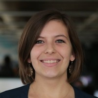
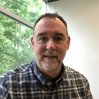
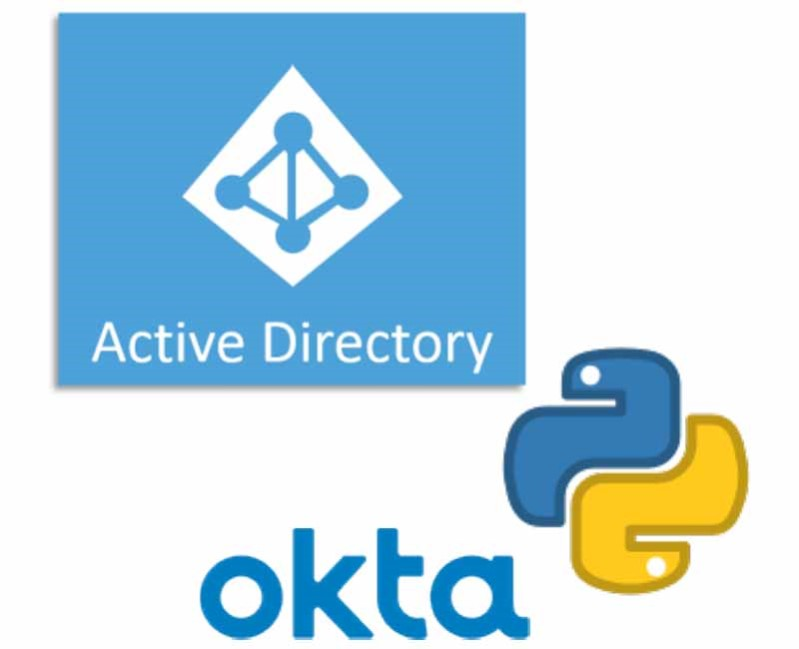

# {{ page.title }}

[Andrew Doering](index-dark.html)

*   [About](#hero)
*   [Skills](#abilities)
*   [Resume](#resume)
*   [Testimony](#testimonial)
*   [Blog](#blog)
*   [Contact](#contact)

I'm Andrew Doering
==================

Language : Multilingual

Phone : [+1 919-904-4396](tel:+1 919-904-4396)

City : San Francisco, CA

Degree : Bachelors

E-Mail : [contact@andrewdoering.org](mailto:contact@andrewdoering.org)

Nationality : American

[Download CV](https://drive.google.com/file/d/1084E69c3RixxDIvWo1BmsbbcpMzsJ1ro/view)

My Profile
----------

##### Objective

Produce creative solutions by being curious about each component of the problem, which then allows to create a long-term solution. To increase personal knowledge by being exposed to a variety of innovative technologies, new experiences, and diverse locations.

##### Professional Summary

I am a determined person who works hard to complete the most challenging tasks. I adapt quickly when it comes to changing work environments. I enjoy the challenge of self-learning. I plan carefully so whatever I am doing will be successful for the long term. I get excited when working with new technologies and creating new ways to break the mold on traditional systems. Finally, I enjoy thinking "out of the box" to come up with new resolutions on how to resolve these challenges.

While a lage portion of my current position involves Client Endpoint Management and IAM Management in Operations, I have recently taken an interest and invement into serverless infrastructure and logging, alerting and monitoring. I am currently investing my time into learning these subjects.

##### Personal Summary

I grew up in several different states, and grew up with several experiences in life that made me who I am today. I became interested in a variety of activities, specifically snowboarding, hiking, training, music, photography, and cooking.

I grew up taking family trips to Colorado, where we would go skiing. Eventually, I ended up making the transition to snowboarding and have been enjoying since. I routinely make trips to the mountains during the winter time to snowboard and take in the gorgeous scenery and crisp air. I also used to go on several hiking trips when I was younger leading to an ever greater passion for being outdoors. Staying active, training, and exercising is important to me. I go to the gym at least three times a week to stay fit.

Art & Media, are an important part of my life. I played the drums and various percussion instruments as I was growing up. Playing in jam bands that focused on rock and jazz. Now a days, I tend to enjoy music more than playing it, listening to anything from rock & metal, classical, electronic, hip-hop, and seeing concerts when possible.

An interesting fact about me: I love experiencing new cultures, and travelling. Places I would like to visit in the future include: India, Iceland, Austria, Russia, Japan to name a few. Some of the countries I have been to include: Sweden, Norway, Iceland, Germany, Poland, and various others in Europe. Experiencing the food, the people, and the history of each country.

My Abilities
------------

I have found the best way is by self-learning and hands-on experience. When guidance is required, I then tend to rely on fellow employees, managers, and communities to help advance my knowledge and abilities. Right now I am specifically interested in Continuous Integration and Delivery for endpoint automation and testing, creating tools with python that automate system(s), serverless infrastructure configurations, logging and monitoring, and cloud based automation and integration.

Endpoint Management

Teaching & Mentoring

Leadership

Adaptability

My Skills
---------

**Client Platform Engineering:**

AutoPkg(r) Bash Chocolatey macOS macOS packaging Munki Powershell Python Server 2019 Windows 10

**SaaS Administration:**

Atlassian Suite Asana Azure AD G Suite Github Okta Meraki Office Suite / O365 RingCentral Slack Workspace One (Airwatch) Zoom

**Infrastructure Management:**

AWS Azure DHCP / isc-dhcp DNS / bind9 Docker GCP Jenkins Networking (CCNA/CCNP) Palo Alto Network PostgreSQL Puppet Ubiquiti Networks Virtualization (ESXi, Xen)

**Other:**

Custom SAML Deployments git Technical Writing

**Languages:**

English - Native Swedish Norwegian

My Resume
---------

### Work Experience

*   ###### ThousandEyes
    
    Senior IT Engineer
    
    January, 2019 - Present
    
    Currently work on major infrastructure/architectual changes and company wide deployments. Some examples of responsibilities and achievements include: Lead for Cisco Acquisition in IT & Business-Related Services, for discovery and post-close. Team Lead for IT Engineering, and Tier 3 Escalation Support to IT Support team. Spearheaded transition from WebEx to Zoom globally, including global deployment of Zoom Rooms in each location, creating a 75% improvement in satisfaction across the company. Spearheaded large scale Workspace One (MDM) deployment to all macOS and Windows machines with the use of open source tools to scale to 400+ employees. Developed a zero-touch deployment solution for macOS and Windows using open source tools, decreasing provisioning time from 200 minutes to 20 minutes (90% improvement). Created internal migration plan from manual HR & employee creation workflows to automated workflows through BambooHR and Okta, reducing input error in user creation. Deployed FedRAMP backend components of our software platform, created FedRAMP (strict) policies to support internal improvement plan over the next year. Created and executed migration plan to deprecate on-premise Active Directory in favor of cloud based IAM solutions through Okta, and AzureAD interop for Windows clients. Outlined serverless infrastructure improvements in GCP environment for existing services.
    
*   ###### ThousandEyes
    
    IT Support Engineer II
    
    January, 2016 - December, 2018
    
    Hired as first IT employee in the company. Some responsibilities and achievements include: Boot strap IT and Help function, starting headcount of 50 to the current headcount of ~430. Create foundational policies (based around ITIL) for the helpdesk function and roles, including SLA, reporting data, priority definitions, on-call system. Developed solutions for full disk encryption (FDE) & key escrow solution, migration from HipChat to Slack, Single Sign-On (SSO) projects, Munki EUC deployment, and open source asset management database (SnipeIT) deployed into Google Cloud Platform. Administration of Atlassian, Active Directory, G Suite, Github, Okta, WebEx, and others. Deployed three new office locations (Austin, London, San Francisco) consisting of AV-equipment, networking equipment, VoIP equipment in short time frames. Created and deployed Local Administrator Password Solution for macOS with custom python script. Vendor Management, including local and international vendors (US, Great Britain, Ireland, Australia, Japan, Singapore, Germany). Travel to offices as needed/when required to support local conferences, on-site break/fix issues, and employee base.
    
*   ###### Lord Corporation
    
    Information Systems Intern
    
    July, 2011 - August, 2012
    
    Mainly performed intern-based duties, answering tier 1 and 2 support tickets. This included desktop configurations, phone setups, break/fix tickets, and organizational aspects of hardware and software.
    

### Education

*   ###### East Carolina University
    
    Bachelor of Science - Industrial Technology
    
    August, 2013 - August, 2015
    
    Took courses pertaining in various fields in Industrial Technology, including Analytics, Systems Engineering, International Communications, Global Learning, and more. East Carolina University also had a study abroad program with several universities in the Nordics, and I choose to spend one year abroad. I also participated in a college community called Quest, to help ease transfer students transition into the university.
    
*   ###### Linnéuniversitetet / Linnaeus University
    
    Study Abroad
    
    August, 2014 - June, 2015
    
    Studied on an exchange semester in Sweden, with courses focusing on International Law, Networking Security, Swedish Culture (Sports, Art, and Film). I also took courses remotely at my home university during this time. I participated in various international student festivals, local festivals, and school led activies.
    
*   ###### Wake Technical Community College
    
    Associates of Science - Networking Technologies
    
    January, 2009 - May, 2013
    
    Took courses here to transition to a four year school. Degree coureses were related primarily to CCNA and CCNP based content, Red Hat Administration, Windows System Administration.
    

### Volunteering

*   ###### Young Scandinavians Club
    
    Web Tech
    
    May, 2019 - Present
    
    Help maintain a wordpress ecommerce website that includes roughly one thousand members. Performing simple tasks, and maintenace related activities.
    
*   ###### Norrlands Nation
    
    Sports Commitee Member & Photographer
    
    January, 2015 - June, 2015
    
    Created advertising material for several sporting events within Norrlands such as: dodgeball, floorball, and soccer. Also took photographs of the events for use on social media.
    
*   ###### Sivans
    
    Various
    
    August, 2014 - June, 2015
    
    I performed various front of house roles in a Swedish student pub that primarily served Swedish students. Often working behind the bar to practice speaking in Swedish, or working as security. On average the bar would serve 500 students a night.
    
*   ###### Overclock.net
    
    Game Server Administrator
    
    January, 2010 - January, 2014
    
    I took over the game server administration role as an avid fan of the Battlefield series, to manage two ranked servers with three different game modes (Rush, Conquest, and 32-man). I performed the following tasks: Managed several game servers for the Battlefield video game series, Managed a team of ten game server moderators, Remotely configured and applied updates, Installed software so that other game moderators could remotely manage the game servers without actively playing the game, Allowed players to manage certain elements of the game (map choice, kick/voting, reporting/alerting admins). I also clearly defined policies, server & play rules, update mechanisms, patch time slots
    

*   ###### Växjö International Students
    
    Sports Commitee Member & Photographer
    
    January, 2015 - June, 2015
    
    Assisted in setting up events like VIS Sports Saturday, Volleyball competitions, and other events that created activities for international students. Also created events pertaining to sports in and around the city, and led a ski trip to Isaberg. Also took photographs of the events for use on social media.
    
*   ###### Slottstalarna
    
    Various
    
    August, 2014 - June, 2015
    
    I performed various front of house roles in a Swedish student pub that served a mixture of Swedish and international students. Often working behind the bar to practice speaking in Swedish and due to the fast paced environment. On average the bar would server 400 student a night.
    
*   ###### East Carolina University
    
    Study Abroad
    
    August, 2013 - May, 2015
    
    Presented to potential students and parents of the university from groups of 10 to 100. Described transfer programs in-depth, adjusting as a non-traditional student and activities to get involved with at the university for inbound students.
    
*   ###### Overclock.net
    
    Networking Editor
    
    October, 2009 - December, 2012
    
    Interviewed for the role to write documentation and publications related to networking content for the website on overclock.net under the username "GH0" or "Lige", an example of writing can be [found here](https://www.overclock.net/forum/45-networking-security/684875-guide-interworkings-internet.html#post7409055).
    

" Andrew was able to push forward and successfully complete this (Meeting Room Management) project that solves a big internal issue the company has been having for a while. Andrew worked closely with the Finance team and implemented the asset management (system). Andrew created a detailed and thorough plan to implement a laptop management system, one of the biggest IT challenges we have. "

#### \-Paulo Cabido, Sr. Director of Engineering Operations

" It's been great to see the thought and effort that you put into the facility-related IT projects (even the frustrating and unreasonable ones haha). It does not go unnoticed or unappreciated!👍 "

#### \-Natalie Pinto, Operations Manager

" Literally within minutes of me placing the request Andrew called me to install the software on my system, which he completed with swift professionalism. ... The speed of fulfillment of the requests and the professionalism demonstrated by each team member along the chain were truly exceptional displays of customer service – a feat not easily accomplished in an area as challenging as client support. "

#### \-Ross Berrier, Sourcing Manager, Indirect Goods & Services

" Wanted to give some Kudos to Andrew for identifying a simple fix to an issue our group has been having for a couple of years with HFM add-in for excel crashing. Your group probably spent 12 hrs on this issue last year rebuilding profiles, pc’s etc…, so this will save us all some time. "

#### \-Nathan Houston, Sr. Business Analyst

Latest Articles
---------------

Check out my latest blog posts below, or just [click here](../blog/) to go straight to my blog.

##### [Transitioning to Okta from Active Directory](../blog/2020/08/08/transitioning-to-okta-from-active-directory-new-directory-service-infrastructure/)

How we transitioned off of Active Directory to a cloud centric Okta service ...

[Read More...](../blog/2020/08/08/transitioning-to-okta-from-active-directory-new-directory-service-infrastructure/)

##### [Connecting Workspace One with Okta's LDAP interface](../blog/2019/12/22/workspace-one-okta-users-and-groups-working-with-dep-enrollment/)

Creating interopability between Workspace One and Okta, using the ldap interface to lookup users and groups ...

[Read More...](../blog/2019/12/22/workspace-one-okta-users-and-groups-working-with-dep-enrollment/)

##### [Using nudge on macOS](../blog/2019/12/10/macos-using-nudge-to-deploy-major-and-minor-os-updates/)

Deploying major and minor OS Updates via nudge - an open source tool ...

[Read More...](../blog/2019/12/10/macos-using-nudge-to-deploy-major-and-minor-os-updates/)

Get In touch
------------

I am quite social, so please feel free to contact me if you would like to discuss something that you see here. I am also available if you would like to just chat about anything you find here. You can find any relevant contact information below, or fill out your information to the right. I look forward to hearing from you!

#### About this form.

This form to the right is linked directly to a Google Spreadsheet, this form does not send any emails. I will be notified immediately once you submit the appropriate information.

#### Sound interesting? contact me!

  

#### About Me

Andrew Doering resides in San Francisco, and currently maintains a position at ThousandEyes as a Senior IT Engineer.

#### Contact Us

*   San Francisco, CA 94109 USA
*   [+1 919 904 4396](tel:+1 919-904-4396)
*   [contact@andrewdoering.org](mailto:contact@andrewdoering)

#### My Socials

*   [Facebook](https://www.facebook.com/and.doe)
*   [LinkedIn](https://www.linkedin.com/in/andrewdoering)
*   [Github](https://www.github.com/delize)
*   [Instagram](https://www.instagram.com/dolos01)
*   [andrew-doering](skype:andrew-doering)
*   [@heimdall](https://www.macadmins.org/)

Copyright © 2020

[Back To Top](javascript:void(0);)

window.jQuery.fn.modal || document.write('<script src="assets/js/bootstrap.js"><\\/script>') (function ($) { $(function () { if ($('body').css('color') !== 'rgb(51, 51, 51)') { $('head').prepend('<link rel="stylesheet" href="assets/css/bootstrap.css">'); } }); })(window.jQuery); slyslider(); d
-->